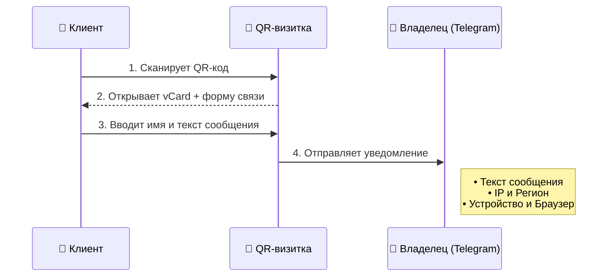

## QR-код на визитке: зачем

Бумажная визитка теряется. **Qr код для визитки** остаётся в телефоне клиента — с правильным номером, сайтом и Telegram.

Запрос **«создать qr код для визитки»** — 130+ показов в месяц; **«qr код для визиток бесплатно»** — популярен у ИП.

## Что попадает в vCard

- Имя и должность
- Телефон и email
- Сайт и соцсети
- Логотип компании
- Ссылка на [оплату](/qr-kod-dlya-oplaty.html) или портфолио

## Как создать QR для визитки

1. Откройте [QR-визитки](/qr-business-cards.html) в QrStars.
2. Заполните поля контакта.
3. Добавьте [логотип](/qr-kod-s-logotipom.html).
4. Скачайте код для типографии.

**Создать qr код для визитки** можно за минуту — вместо набора номера вручную.

## Для команд и сетей

Каждый сотрудник — свой QR, единый стиль бренда. HR меняет контакты централизованно через [динамический QR](/dinamicheskiy-qr-kod.html).

## 💬 Форма связи: получайте сообщения прямо из QR-визитки

QR-визитка от QrStars — это не просто сохранение контактов, а полноценный инструмент для общения. Вы можете включить **опциональную функцию обратной связи**, привязав свой Telegram или другой удобный канал. 

Когда клиент сканирует вашу визитку, помимо контактов он видит удобное окошко **«Написать человеку»**. Ему достаточно указать своё имя и ввести текст — сообщение моментально отправится вам.

**Вместе с сообщением вы получаете расширенные данные о собеседнике:**
- 👤 Имя отправителя и текст сообщения
- 🌍 Регион и точный IP-адрес
- 💻 Данные об устройстве (модель смартфона, ОС)
- 🌐 Используемый браузер

### Как это работает:

Это идеальное решение для нетворкинга: новый знакомый может сразу отправить вам запрос или предложение, а вы — получите ценный лид с технической аналитикой.

[Создайте QR для визитки](/qr-business-cards.html) — контакты в одном сканировании.
